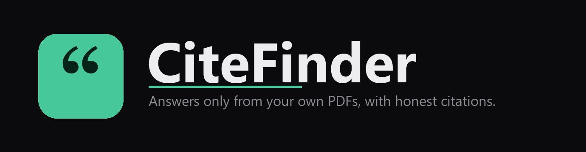

# CiteFinder


A local-first RAG tool that answers questions **only from your own PDFs**, points to **where** each answer came from (file and page), and turns a source into a **formatted citation** only once you confirm its details. Nothing is invented, and nothing leaves your machine by default.

Drop a folder of readings into a chat, ask in plain English, and get a grounded, tutor-style answer with a **Locator** for every claim, plus an APA / Harvard / IEEE citation on demand.

---

## Download and run (Windows)

CiteFinder ships as a single Windows installer that bundles everything except the answer model: its own PostgreSQL and pgvector, plus the local embedding model, are inside the package. There is no Docker, no database setup, and nothing to configure before you start ingesting and searching.

1. **Download** the latest `CiteFinder-Setup-<version>.exe` from the [Releases](../../releases) page.
2. **Run it.** It installs per-user (no admin needed). Because the installer is not code-signed yet, Windows SmartScreen may warn you: click **More info**, then **Run anyway**.
3. **Launch CiteFinder** from the Start menu (or the desktop shortcut). On first run it sets up its private database in your app-data folder, which takes a few seconds.
4. **Choose how answers are generated** (a one-time, in-app step):
   - **Cloud:** paste a key for any OpenAI-compatible provider (for example **Groq**, which is free). This is the fastest path on any machine.
   - **Local:** point it at a local [Ollama](https://ollama.com) model for a fully offline setup (needs enough RAM).

   Ingesting and searching are always local and need no LLM. Only *answering* a question uses one.

**Requirements:** Windows 10/11 (64-bit), about 1.2 GB of free disk, and the Edge **WebView2** runtime (already present on current Windows 10/11). Your documents, embeddings, and database never leave the machine. With a cloud LLM, only the text of the chunks used to answer a question is sent to that provider, and only when you ask.

---

## Why

Students and researchers accumulate dozens of PDFs and need to find *where* a topic is discussed in their own material, understand it, and cite it correctly. A general chatbot hallucinates and cites things you never read. CiteFinder is the opposite: a grounded tutor over *your* corpus, honest about where every statement comes from.

Two integrity rules drive the whole design:

1. **Answers come only from your uploaded material**, never the model's own knowledge and never the open web. If nothing is covered, it refuses.
2. **Attribution is a Locator by default** (file and page, always honest). A formatted citation is an opt-in extra, built in code from metadata *you confirm*, never auto-generated from a guess.

## Features

- **Grounded answers:** a strict tutor prompt plus a dense-distance coverage gate. Off-topic or empty queries are refused *before* any LLM call.
- **Hybrid retrieval:** dense vector search (pgvector) fused with Postgres full-text search via Reciprocal Rank Fusion, with adaptive multi-query expansion only when a result looks weak.
- **Locate-by-default, cite-on-confirmation:** every answer carries Locators; a citation appears only for sources whose details you have confirmed.
- **Real citations, three styles, three work types:** APA / Harvard / IEEE for books, journal articles, and websites, with both the in-text form and the reference-list entry.
- **DOI auto-fill:** most journal PDFs carry a DOI. CiteFinder detects it and, on one click, fetches the authoritative author, title, journal, volume, and pages from CrossRef for you to verify. This turns "type everything" into "confirm what we found".
- **Chat-owned corpora:** each chat owns the files added to it, so a question searches only that chat's material.
- **Local-first, hosted opt-in:** embeddings always run locally; the LLM is your choice of a local Ollama model or any OpenAI-compatible provider.
- **Evaluated, not guessed:** retrieval thresholds are tuned from a labeled gold set (recall@k / hit@k / MRR).

## How it works

```
INGEST   PDF -> extract text per page -> chunk + tag (page/source/chat)
            -> detect DOI + metadata guess -> embed locally (e5-small-v2, ONNX)
            -> store source + vectors in pgvector (atomically)

QUERY    question -> embed -> hybrid retrieve (dense + keyword, RRF)
            -> refuse if nothing is covered
            -> local/hosted LLM answers using ONLY those chunks
            -> answer + a Locator per part (plus a Citation for confirmed sources)
```

## Tech stack

| Layer | Choice |
|------|--------|
| Backend | Python, FastAPI |
| Vector store | PostgreSQL + pgvector (bundled in the desktop app; Docker for dev) |
| Embeddings | `e5-small-v2` via ONNX Runtime (local, CPU, torch-free, 384-dim) |
| LLM | Ollama (for example Phi-4 Mini) or any OpenAI-compatible endpoint (for example Groq) |
| Citations | CrossRef REST API for opt-in DOI lookup (stdlib `urllib`, no key) |
| PDF parsing | pypdf |
| Desktop | pywebview (Edge WebView2), packaged with PyInstaller and Inno Setup |
| Frontend | Vanilla SPA (no build step) served by FastAPI |

---

## Run from source (developers)

The installer is the way in for users. To hack on CiteFinder, run it from source against Docker Postgres.

**Prerequisites:** Docker, Python 3.11+, and either a local [Ollama](https://ollama.com) install or an API key for a hosted OpenAI-compatible provider.

```bash
# 1. Start Postgres + pgvector
docker run -d --name citefinder-db -p 5432:5432 \
  -e POSTGRES_PASSWORD=devpass -e POSTGRES_DB=citefinder pgvector/pgvector:pg16

# 2. Create a virtual environment and install dependencies
python -m venv venv
source venv/Scripts/activate        # Windows (Git Bash); use venv/bin/activate on macOS/Linux
pip install -r requirements.txt

# 3. Create the database schema (idempotent)
python setup_db.py

# 4. Run the web app, then open http://localhost:8000
python app.py
```

### Configuration (source runs)

CiteFinder reads configuration from a `.env` file (auto-loaded on startup). Copy the template and fill it in:

```bash
cp .env.example .env
```

Leave the LLM settings unset to use a local Ollama model. To use a hosted provider such as **Groq** (OpenAI-compatible), set:

```ini
# .env
CITEFINDER_LLM_BASE_URL=https://api.groq.com/openai/v1
CITEFINDER_LLM_KEY=gsk_your_key_here
CITEFINDER_LLM_MODEL=llama-3.3-70b-versatile
```

Embeddings always run locally regardless of this setting, so ingestion never sends data or costs tokens.

### Usage (Python API)

The web UI is the easiest way in, but every capability is a plain function you can script:

```python
from chats import create_chat
from add_source import add_source_folder
from query import answer

# A chat owns its corpus. Add a whole folder of PDFs (non-blocking, no prompts).
chat_id = create_chat(title="Thesis sources")
add_source_folder("data/my_pdfs", chat_id=chat_id)

# Ask a question, grounded only in this chat's material.
text, used = answer("How is user authentication handled?", chat_id=chat_id)
print(text)                       # tutor-style answer, or a refusal if not covered
for c in used:                    # Locators: where each part came from
    print(f"  {c['filename']} - p. {c['page']}")
```

Turn a source into a formatted citation **after** confirming its details:

```python
from sources import confirm_source, cite_source

# Lock real metadata (needs author + year + a real title). This is persisted.
confirm_source(source_id, author="Khan, H. M. H.",
               title="Encouraged Digital Academic Portal", year="2025",
               work_type="book", meta={"publisher": "Academic Press"})

# Now cite it in any style; the style is chosen at cite time, never stored.
c = cite_source(source_id, style="APA")
print(c["in_text"])    # (Khan, 2025)
print(c["reference"])  # Khan, H. M. H. (2025). Encouraged Digital Academic Portal. Academic Press.
```

### Evaluation

Retrieval quality is measured, not assumed. The harness scores page-level `recall@k` / `hit@k` / `MRR` over a labeled gold set and tunes the coverage threshold from data:

```bash
python evaluate.py                  # compare dense vs keyword vs hybrid
python evaluate.py --tune-floor     # set the relevance floor from gold + off-topic sets
```

On the current gold set, hybrid retrieval reaches **hit@5 = 1.00** and **recall@5 = 0.86**.

### Building the installer

```bash
pip install -r requirements-dev.txt          # Pillow + PyInstaller (build-only)
python make_icon.py                           # regenerate citefinder.ico
venv/Scripts/pyinstaller CiteFinder.spec      # -> dist/CiteFinder/
"%LocalAppData%\Programs\Inno Setup 6\ISCC.exe" CiteFinder.iss   # -> installer/CiteFinder-Setup-*.exe
```

The bundle vendors the portable PostgreSQL and the MSVC-built pgvector (under `vendor/`, gitignored) plus the e5 ONNX model. See [docs/0007](docs/0007-bundle-postgres-fetch-llm.md).

## Project layout

```
*.py        # backend + entry points (run from the repo root)
web/        # the vanilla SPA served by app.py
docs/       # CONTEXT.md (glossary), DEVLOG.md, and the ADRs (0001 to 0007)
data/       # your PDFs + uploads/  (gitignored)
```

Key modules: `app.py` (web API), `desktop.py` (native-window launcher), `pgserver.py` (bundled-Postgres lifecycle), `query.py` (retrieval + grounded answer), `add_source.py` (ingest), `sources.py` (confirm/cite), `citations.py` (Locator + citation formatting), `crossref.py` (DOI lookup).

## Design and decisions

The vocabulary lives in [docs/CONTEXT.md](docs/CONTEXT.md). The reasoning behind each major choice is recorded as ADRs in [docs/](docs/):

- **0002:** local by default, hosted opt-in
- **0003:** locate by default, cite on confirmation
- **0004:** grounded tutor, only from your material
- **0005:** a chat owns its corpus
- **0006:** single-user desktop app (multi-user / hosted rejected)
- **0007:** bundle Postgres, fetch the LLM on demand

## Status

Shipped end-to-end as a downloadable Windows desktop app: folder ingest, hybrid retrieval, grounded answers with Locators, confirm, and cite (APA/Harvard/IEEE, with DOI auto-fill), in a native window over a bundled database, with no Docker and no setup. Single-user by design ([ADR 0006](docs/0006-single-user-desktop-app.md)). The installer is currently unsigned (SmartScreen "Run anyway"). See [docs/DEVLOG.md](docs/DEVLOG.md) for the build history.
